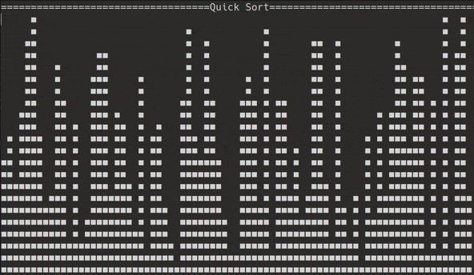

<h1 align="center">
    Visualization of different sorting algorithms</h1>

<p align="center">
    </p>

Welcome to our sorting algorithm visualization project! This program offers real-time visualizations of various sorting
algorithms, allowing you to understand and compare them in action. It currently supports the following algorithms:

- Bubble Sort
- Selection Sort
- Quick Sort
- Insertion Sort
- Heap Sort

## Table of Contents

- [Algorithms](#algorithms)
    - [Bubble Sort](#bubble-sort)
    - [Selection Sort](#selection-sort)
    - [Quick Sort](#quick-sort)
    - [Insertion Sort](#insertion-sort)
    - [Heap Sort](#heap-sort)
- [How to Build & Run](#how-to-build--run)
    - [How to Build executable file?](#how-to-build-executable-file)
    - [How to Run](#how-to-run)

# Algorithms

## Bubble Sort

**Bubble Sort** is a simple sorting algorithm that repeatedly steps through the list, compares adjacent elements, and
swaps them if they are in the wrong order. This process continues until the list is fully sorted, with larger elements "
bubbling" to the top. For e.g: in ascending order, the largest elements gradually move to the last position with each
pass.

<details> <summary>Show Bubble Sort Visualization</summary> <p align="center">  </p> </details>

## Selection Sort

**Selection Sort** is a simple comparison-based algorithm that sorts a list by dividing it into a sorted and an unsorted
part. It repeatedly finds the smallest (or largest) element from the unsorted part and swaps it with the first unsorted
element, gradually growing the sorted portion until the entire list is sorted.

<details> <summary>Show Selection Sort Visualization</summary> <p align="center">  </p> </details>

## Quick Sort

**QuickSort** is a highly efficient sorting algorithm that uses a divide-and-conquer approach. It selects a "pivot"
element and partitions the array into two sub-arrays: one with elements less than the pivot and one with elements
greater than
the pivot. This process is recursively applied to each sub-array until the entire list is sorted.

<details> <summary>Show Quick Sort Visualization</summary> <p align="center">  </p> </details>

## Insertion Sort

**Insertion Sort** is a simple sorting algorithm that builds a sorted list one element at a time. It picks the next
element
from the unsorted list, finds its correct position in the sorted list, and inserts it there. This process repeats until
all elements are sorted.

<details> <summary>Show Insertion Sort Visualization</summary> <p align="center">  </p> </details>

## Heap Sort

**HeapSort** is a sorting algorithm that uses a binary heap data structure to sort elements. It first builds a max heap
from the input data, then repeatedly removes the largest element from the heap and places it at the end of the list,
sorting
the list in ascending order.


<details> <summary>Show Heap Sort Visualization</summary> <p align="center">  </p> </details>

# How to Build & Run

You need at least java 21

## How to Build executable file?

1. Clone this repo
2. Open terminal in a root folder and run this command

```
mvn clean package
```

This command will create `/taget` folder and executable `sav-version-jar-with-dependencies.jar` inside.

## How to Run?

1. Download `.jar` file from [latest release](https://github.com/bruch-alex/sorting-algorithm-visualization/releases/latest).

2. Open terminal in a folder where the `.jar` file is located. Run this command to start the program:

```
java -jar sav-1.0-jar-with-dependencies.jar
```
